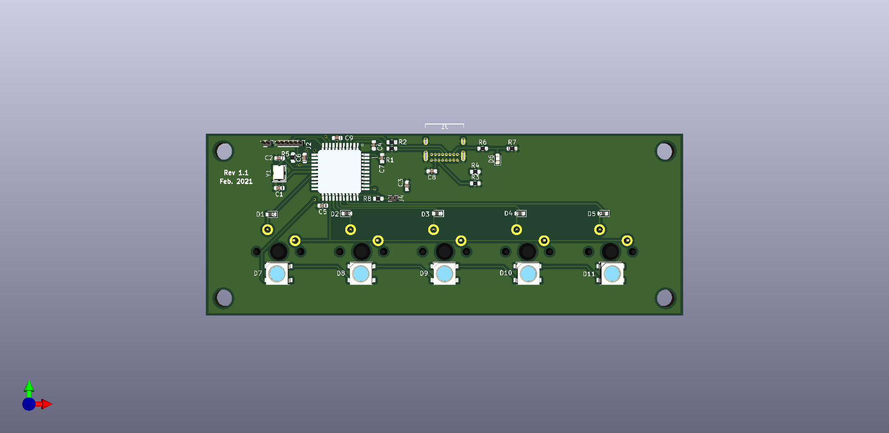

## The Pain 5 Keyboard!

A 5-key keyboard that depends on pressing keys in combination! Supports up to 120 keys and/or macros!

### Features
- ATMEGA32U4 Based.
- QMK compatible.
- One-handed operation.
- 0603 components (good for hand placing!).
- Comes with all the files for JLCPCB production.

